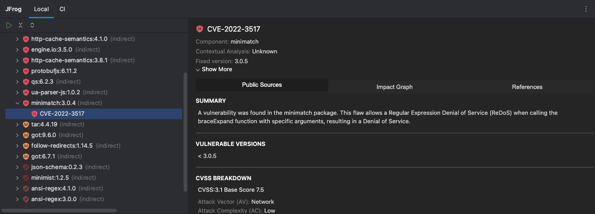
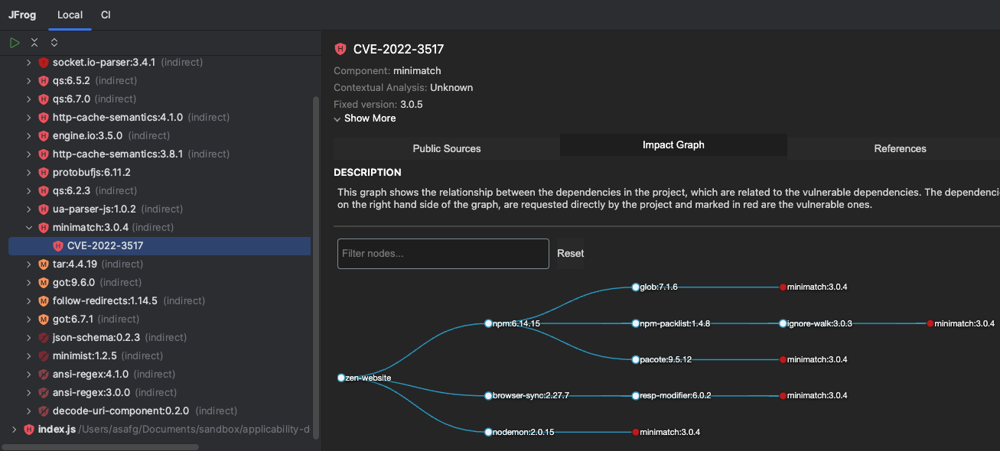

[](#readme)

<div align="center">

# JFrog IntelliJ IDEA Plugin


[](https://github.com/jfrog/frogbot#readme)
[](https://github.com/jfrog/jfrog-idea-plugin/actions/workflows/test.yml)
[](https://plugins.jetbrains.com/plugin/9834-jfrog)

</div>

# Table of Contents

- [About this Plugin](#about-this-plugin)
- [Supported Packages](#supported-packages)
- [Getting Started](#getting-started)
  - [Connecting to Your JFrog Environment](#connecting-to-your-jfrog-environment)
  - [Apply Xray Policies](#apply-xray-policies)
- [Using the Plugin](#using-the-plugin)
  - [The Local View](#the-local-view)
    - [Scanning a Project](#scanning-a-project)
    - [Viewing Vulnerability Details](#viewing-vulnerability-details)
    - [CVEs Contextual Analysis](#cves-contextual-analysis)
    - [Secrets Detection](#secrets-detection)
    - [Infrastructure as Code (IaC) Scan](#infrastructure-as-code-iac-scan)
    - [Severity Icons](#severity-icons)
  - [The CI View](#the-ci-view)
    - [How Does It Work?](#how-does-it-work)
    - [Setting Up CI Integration](#setting-up-ci-integration)
- [Android Studio Support for JCEF](#android-studio-support-for-jcef)
- [Troubleshooting](#troubleshooting)
- [Reporting Issues](#reporting-issues)
- [Contributions](#contributions)
- [Release Notes](#release-notes)

# About this Plugin

The plugin allows developers to find and fix security vulnerabilities in their projects and to see valuable information
about the status of their code by continuously scanning it locally with [JFrog Security](https://jfrog.com/xray/).

### What security capabilities do we provide?
#### Basic
<details>
  <summary>Software Composition Analysis (SCA)</summary>
Scans your project dependencies for security issues and shows you which dependencies are vulnerable. If the vulnerabilities have a fix, you can upgrade to the version with the fix in a click of a button.
</details>

<details>
  <summary>CVE Research and Enrichment</summary>
For selected security issues, get leverage-enhanced CVE data that is provided by our JFrog Security Research team.
Prioritize the CVEs based on:

- **JFrog Severity**: The severity given by the JFrog Security Research team after the manual analysis of the CVE by the team.
CVEs with the highest JFrog security severity are the most likely to be used by real-world attackers.
This means that you should put effort into fixing them as soon as possible.
- **Research Summary**: The summary that is based on JFrog's security analysis of the security issue provides detailed technical information on the specific conditions for the CVE to be applicable.
- **Remediation**: Detailed fix and mitigation options for the CVEs

You can learn more about enriched CVEs [here](https://jfrog.com/help/r/jfrog-security-documentation/jfrog-security-cve-research-and-enrichment).

Check out what our research team is up to and stay updated on newly discovered issues by clicking on this link: <https://research.jfrog.com>
</details>

#### Advanced
*Requires Xray version 3.66.5 or above and Enterprise X / Enterprise+ subscription with [Advanced DevSecOps](https://jfrog.com/xray/#xray-advanced)).*

<details>
  <summary>CVEs Contextual Analysis</summary>
Uses the code context to eliminate false positive reports on vulnerable dependencies that are not applicable to the code. 
CVEs Contextual Analysis is currently supported for Python, Java and JavaScript code.
</details>

<details>
  <summary>Secrets Detection</summary>
Prevents the exposure of keys or credentials that are stored in your source code.
</details>

<details>
  <summary>Infrastructure as Code (IaC) Scan</summary>
Secures your IaC files. Critical to keeping your cloud deployment safe and secure.
</details>

#### Additional Perks

- Security issues are easily visible inline.
- The results show issues with context, impact, and remediation.
- View all security issues in one place, in the JFrog tab.
- For Security issues with an available fixed version, you can upgrade to the fixed version within the plugin.
- Track the status of the code while it is being built, tested, and scanned on the CI server.

In addition to IntelliJ IDEA, the plugin also supports the following IDEs:

- WebStorm
- PyCharm
- Android Studio
- GoLand

# Supported Packages

| Features                                          | Go | Maven | Gradle / Kotlin | npm | Yarn v1 | Python | Terraform |
|---------------------------------------------------|:--:|:-----:|:---------------:|:---:|:-------:|:------:|:---------:|
| Software Composition Analysis (SCA)               | ✅  | ✅   | ✅              |  ✅ | ✅      |  ✅    |  ❌       |
| CVE Research and Enrichment                       | ✅  | ✅   | ✅              |  ✅ | ✅      |  ✅    |  ❌       |
| Upgrade vulnerable dependencies to fixed versions | ✅  | ✅   | ✅              |  ✅ | ✅      |  ❌    |  ❌       |
| CVEs Contextual Analysis                          | ❌  | ✅   | ✅              |  ✅ | ✅      |  ✅    |  ❌       |
| Secrets Detection                                 | ✅  | ✅   | ✅              |  ✅ | ✅      |  ✅    |  ✅       |
| Infrastructure as Code (IaC) Scan                 | ❌  | ❌   | ❌              |  ❌ | ❌      |  ❌    |  ✅       |

# Getting Started

1. Install the JFrog IntelliJ IDEA Plugin via the Plugins tab in the IDE settings, or in [JetBrains Marketplace](https://plugins.jetbrains.com/plugin/9834-jfrog).
2. [Connect the plugin to your JFrog environment](#connecting-to-your-jfrog-environment).
3. [Start](#using-the-plugin) using the plugin.

## Connecting to Your JFrog Environment

<details>
  <summary>Optionally set up a free JFrog Environment in the Cloud</summary>
Need a free JFrog environment in the Cloud, so that JFrog IntelliJ IDEA Plugin can connect to it? Just run one of the following commands in your terminal. The commands will do the following:

1. Install JFrog CLI on your machine.
2. Create a FREE JFrog environment in the Cloud for you.
3. Configure IntelliJ IDEA to connect to your new environment.

**MacOS and Linux using cURL**

```bash
curl -fL https://getcli.jfrog.io?setup | sh
```

**Windows using PowerShell**

```powershell
powershell "Start-Process -Wait -Verb RunAs powershell '-NoProfile iwr https://releases.jfrog.io/artifactory/jfrog-cli/v2-jf/[RELEASE]/jfrog-cli-windows-amd64/jf.exe -OutFile $env:SYSTEMROOT\system32\jf.exe'" ; jf setup
```

</details>

<details>
  <summary>Connect the JFrog Plugin to an existing JFrog Environment</summary>

You can connect the plugin to your JFrog environment using one of the following methods:

<details>
  <summary>Using the IDE Settings</summary>
  Once the plugin is successfully installed, connect the plugin to your instance of the JFrog Platform:

  1. If your JFrog Platform instance is behind an HTTP proxy, configure the proxy settings as described [here](https://www.jetbrains.com/help/idea/settings-http-proxy.html).
     Manual proxy configuration is supported since version 1.3.0 of the JFrog IntelliJ IDEA Plugin. Auto-detect proxy settings is supported since version 1.7.0.
  2. Under **Settings (Preferences)** | **Other Settings**, click **JFrog Global Configuration**.
  3. Set your JFrog Platform URL and login credentials.
  4. Test your connection to Xray using the Test Connection button.
  
  
</details>

<details>
  <summary>Using Environment Variables</summary>
The plugin also supports connecting to your JFrog environment using environment variables:

1. Under **Settings (Preferences)** | **Other Settings**, click **JFrog Global Configuration**.
2. Mark **Load connection details from environment variables**.

You may provide basic auth credentials or access token as follows:

> **_NOTE:_**  For security reasons, it is recommended to unset the environment variables after launching the IDE.

- `JFROG_IDE_PLATFORM_URL` - JFrog Platform URL
- `JFROG_IDE_USERNAME` - JFrog Platform username
- `JFROG_IDE_PASSWORD` - JFrog Platform password
- `JFROG_IDE_ACCESS_TOKEN` - JFrog Platform access token

</details>
</details>

> **NOTES:**
> - If your JFrog Platform instance uses a domain with a self-signed certificate, add the certificate to IDEA as described [here](https://www.jetbrains.com/help/idea/settings-tools-server-certificates.html).
> - From JFrog Xray version **1.9** to **2.x**, IntelliJ IDEA users connecting to Xray from IntelliJ are required to be granted the ‘View Components’ action in Xray.
> - From JFrog Xray version **3.x**, as part of the JFrog Platform, IntelliJ IDEA users connecting to Xray from IntelliJ require ‘Read’ permission. For more information, see [here](https://jfrog.com/help/r/jfrog-platform-administration-documentation/permissions).

## Apply Xray Policies

You can configure the JFrog IntelliJ IDEA Plugin to use the security policies you create in Xray.
Policies enable you to create a set of rules, in which each rule defines security criteria, with a corresponding set of automatic actions according to your needs.
Policies are enforced when applying them to Watches.

If you'd like to use a JFrog Project that is associated with the policy, follow these steps:

1. Create a [JFrog Project](https://jfrog.com/help/r/jfrog-platform-administration-documentation/introduction-to-projects), or obtain the relevant JFrog Project key.
2. Create a [Policy](https://jfrog.com/help/r/jfrog-security-documentation/creating-xray-policies-and-rules) on JFrog Xray.
3. Create a [Watch](https://jfrog.com/help/r/jfrog-security-documentation/configuring-xray-watches) on JFrog Xray and assign your Policy and Project as resources to it.
4. Configure your Project key in the plugin settings: under **Settings (Preferences)** | **Other Settings**, click **JFrog Global Configuration** and go to the **Settings** tab.

If however your policies are referenced through Xray Watches, follow these steps instead:

1. Create one or more [Watches](https://jfrog.com/help/r/jfrog-security-documentation/configuring-xray-watches) on JFrog Xray.
2. Configure your Watches in the plugin settings: under **Settings (Preferences)** | **Other Settings**, click **JFrog Global Configuration** and go to the **Settings** tab.

# Using the Plugin

After the JFrog Plugin is installed, a new JFrog panel is added at the bottom of the screen.
Opening the JFrog panel displays two views:

- The **Local** view displays information about the local code as it is being developed in the IDE.
  You can continuously scan your project locally.
  The information is displayed in the **Local** view.
- The **CI** view allows the tracking of the code as it is built, tested and scanned by the CI server.
  It displays information about the status of the build and includes a link to the build log on the CI server.

## The Local View
### General
The JFrog IntelliJ IDEA Plugin enables continuous scans of your project with the JFrog Platform. The security related information will be displayed under the Local view.
It allows developers to view vulnerability information about their dependencies and source code in their IDE.
With this information, a developer can make an informed decision on whether to use a component or not before it gets entrenched into the organization’s product.

Scan your project by clicking the Run Scan  button.
After the scan is done, a list of vulnerable files will appear.

### Software Composition Analysis (SCA)
Each descriptor file (like pom.xml in Maven, go.mod in Go, etc.) displayed in the JFrog Panel contains vulnerable dependencies, and each dependency contains the vulnerabilities themselves.

By right-clicking on a dependency line, you can jump to the dependency's declaration in the descriptor file or have the depedency upgraded to a version with a fix. 


You can also create an [Ignore Rule](https://jfrog.com/help/r/jfrog-security-documentation/ignore-rules) in Xray.

*Creating Ignore Rules is only available [when a JFrog Project or Watch is defined](#apply-xray-policies).*


Clicking a vulnerability in the list will open the vulnerability details view.
This view contains information about the vulnerability, the vulnerable component, fixed versions, impact paths and much more.




### CVEs Contextual Analysis

*Requires Xray version 3.66.5 or above and Enterprise X / Enterprise+ subscription with Advanced DevSecOps.*

Xray automatically validates some high and very high impact vulnerabilities, such as vulnerabilities that have prerequisites for exploitations, and provides contextual analysis information for these vulnerabilities, to assist you in figuring out which vulnerabilities need to be fixed.

CVEs Contextual Analysis data includes:

- **Contextual Analysis status**: Contextual Analysis results indicating if a CVE was found applicable in your application or not applicable.
- **Contextual Analysis breakdown**: An explanation provided by our research team as to why the CVE was found applicable or not applicable.
- **Remediation**: Contextual mitigation steps and options provided by our research team that assist you with remediating the issues.


### Secrets Detection

*Requires Xray version 3.66.5 or above and Enterprise X / Enterprise+ subscription with Advanced DevSecOps.*

Detect any secrets left exposed inside the code. to prevent any accidental leak of internal tokens or credentials.
> **NOTE:**  To ignore detected secrets, you can add a comment which includes the phrase **jfrog-ignore** above the line with the secret.


### Infrastructure as Code (IaC) Scan

*Requires Xray version 3.66.5 or above and Enterprise X / Enterprise+ subscription with Advanced DevSecOps.*

Scan Infrastructure as Code (Terraform) files for early detection of cloud and infrastructure misconfigurations.


### Severity Icons

The icon demonstrates the top severity issue of a selected component and its transitive dependencies. The following table describes the severities from highest to lowest:

|                                                                                                                                                                                                   Icon                                                                                                                                                                                                    |                Severity                |
|:---------------------------------------------------------------------------------------------------------------------------------------------------------------------------------------------------------------------------------------------------------------------------------------------------------------------------------------------------------------------------------------------------------:|:--------------------------------------:|
|                                                                                                                                                                                                                                                                                                                                               |                Critical                |
|                                                                                                                                                                                                                                                                                                                                                   |                  High                  |
|                                                                                                                                                                                                                                                                                                                                                 |                 Medium                 |
|                                                                                                                                                                                                                                                                                                                                                    |                  Low                   |
|                                                                                                                                                                                                                                                                                                                                                |                Unknown                 |
|  | [Not Applicable](#contextual-analysis) |

## The CI View

The JFrog IntelliJ IDEA Plugin allows you to view information about your builds directly from your CI system.
This allows developers to keep track of the status of their code, while it is being built, tested and scanned as part of the CI pipeline, regardless of the CI provider used.

This information can be viewed inside IntelliJ IDEA, from the **JFrog** Panel, under the **CI** tab.

The following details can be made available in the CI view:

- Status of the build run (passed or failed)
- Build run start time
- Git branch and latest commit message
- Link to the CI run log
- Security information about the build artifacts and dependencies


### How Does It Work?

The CI information displayed in IDEA is pulled by the JFrog IDEA Plugin directly from JFrog Artifactory.
This information is stored in Artifactory as part of the build-info, which is published to Artifactory by the CI server.
Read more about build-info in the [Build Integration](https://jfrog.com/help/r/jfrog-integrations-documentation/build-integration) documentation page.
If the CI pipeline is also configured to scan the build-info by JFrog Xray, the JFrog IDEA Plugin will pull the results of the scan from JFrog Xray and display them in the CI view as well.

### Setting Up CI Integration

Set up your CI pipeline to expose information, so that it is visible in IDEA as described [here](https://jfrog.com/help/r/jfrog-integrations-documentation/setting-up-ci-integration).

Next, follow these steps:

1. Under **Settings (Preferences)** | **Other Settings**, click **JFrog Global Configuration**. configure the JFrog Platform URL and the user you created.
2. Under **Settings (Preferences)** | **Other Settings**, click **JFrog CI Integration**. Set your CI build name in the **Build name pattern** field. This is the name of the build published to Artifactory by your CI pipeline. You have the option of setting * to view all the builds published to Artifactory.
   
3. Click **Apply** and open the **CI** tab under the **JFrog** panel at the bottom of the screen and click the **Refresh** button.

# Android Studio Support for JCEF

The JFrog IntelliJ IDEA Plugin uses JCEF (Java Chromium Embedded Framework) to create a webview component in the plugin's tool window.

Most IntelliJ-based IDEs use a boot runtime that contains JCEF by default.

Android Studio and some older versions of other IntelliJ-based IDEs use a boot runtime that doesn't contain JCEF by default, and therefore the plugin can't be loaded in them.

To solve this issue, open the ["Choose Boot Runtime for the IDE"](https://www.jetbrains.com/help/idea/switching-boot-jdk.html) dialog where you can change the boot runtime to one that contains JCEF.

# Troubleshooting

The JFrog IntelliJ IDES Plugin uses the IntelliJ IDEA log files. By default, the log level used by the plugin is INFO.

You have the option of increasing the log level to DEBUG. Here's how to do it:

1. Go to **Help** | **Diagnostic Tools** | **Debug Log Settings...**
2. Inside the **Custom Debug Log Configuration** window add the following line:

```java
#com.jfrog.ide.idea.log.Logger
```

To see the Intellij IDEA log file, depends on the IDE version and OS as described [here](https://intellij-support.jetbrains.com/hc/en-us/articles/207241085-Locating-IDE-log-files), go to **Help** | **Show/reveal Log in Explorer/finder/Konqueror/Nautilus**.

# Reporting Issues

Please report issues by opening an issue on [GitHub](https://github.com/jfrog/jfrog-idea-plugin/issues).

# Contributions

We welcome community contribution through pull requests. To help us improve this project, please read our [Contribution](./CONTRIBUTING.md#guidelines) guide.

# Release Notes

The release notes are available on [Marketplace](https://plugins.jetbrains.com/plugin/9834-jfrog/versions).
